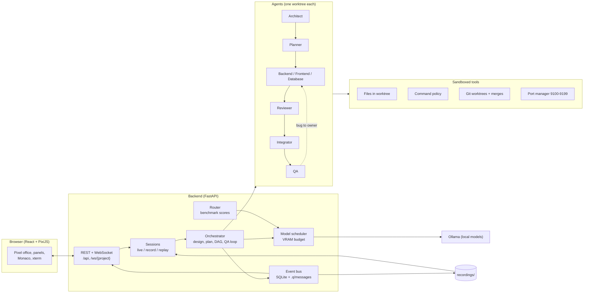

# Q: a local AI software company

Type a goal ("Build a todo app with priorities") and a team of AI employees builds it in a pixel-art office. Every employee is a real
autonomous coding agent with its own role, model, tools, file permissions, memory and git worktree. The office is a live view of the system:
typing is generating, walking to a colleague is a message, sleeping is an unloaded model, a red mark is an error.

Everything runs **locally** on Ollama (an 8 GB laptop GPU is enough). Cloud models are optional and never used silently. A recorded
**Demo mode** replays full builds with no model and no network.

## What is inside

- **Eight employees:** Architect, Planner, Backend, Frontend and Database engineers, Integrator, QA and Code Reviewer, each with its own file ownership and git branch.
- **Contract first:** the Architect writes an API contract with worked examples. Tests, route stubs, database stubs and the starting web page are generated from it, so the agents implement and repair instead of inventing structure.
- **Quality gates:** per-task review, a merge per branch with the full test suite, independent QA tests written from the contract, bugs routed to the owner, a fix loop with termination rules and human escalation.
- **Sandboxed tools:** every path is resolved inside the agent's worktree; commands go through an allowlist, a deny list and an approval policy (Assisted / Supervised / Autonomous).
- **VRAM-aware scheduler and benchmark-driven router:** one model on the GPU at a time, loaded and unloaded on demand; a benchmark leaderboard decides which model fits which role.
- **Record and replay:** a build can be recorded (events, every model response, a git snapshot of the result) and replayed offline at 1x, 2x or 4x. "Open app" works in a replay.

## Architecture



Generated projects live in `workspace/<slug>/`, each its own git repository with `agent/<id>` branches in `.worktrees/`, a `.q/` memory folder
(architecture, spec, API contract, tasks, bugs, reviews, messages) and the app itself.

## Requirements

- Windows 10/11, Python 3.11, Node 20+, Git, [Ollama](https://ollama.com)
- A GPU with 8 GB VRAM for live builds (the models are 4.7 GB, 3.6 GB and 2.5 GB, one loaded at a time). Demo mode needs no GPU.

## Setup

```powershell
# 1. backend
cd backend
py -3.11 -m venv .venv
.\.venv\Scripts\python.exe -m pip install -r requirements.txt

# 2. frontend
cd ..\frontend
npm install

# 3. models (only needed for live builds)
ollama pull qwen2.5-coder:7b
ollama pull qwen3:4b
ollama pull llama3.2:3b

# 4. optional cloud models: copy .env.example to .env and fill in the keys you want
```

## Run

Double-click **`start.bat`** (or run it from a terminal). It frees ports 8000 and 5173, starts the backend and the frontend, opens
http://localhost:5173 and warns if Ollama is not running.

- **Demo mode** (default switch position): pick a recorded build, press **Play demo**, choose 1x / 2x / 4x. Works with Wi-Fi off and without Ollama.
- **Live build:** turn Demo mode off, pick an example goal (or type one), press **Build it**. Click an employee to inspect them, override their model or ask them something directly.

Command line equivalents:

```powershell
backend\.venv\Scripts\python.exe scripts\build.py "Build a calculator with history" --serve
backend\.venv\Scripts\python.exe scripts\record.py "<goal>" --name my-demo --title "My demo" --app "My app" --feature "What it shows"
backend\.venv\Scripts\python.exe scripts\record_demos.py            # re-record the whole demo set (keeps only good runs)
backend\.venv\Scripts\python.exe scripts\benchmark.py --help        # model benchmarks that feed the router and the leaderboard
```

## Tests

```powershell
cd backend;  .\.venv\Scripts\python.exe -m pytest tests -q     # about 500 tests: sandbox, termination rules, router, scheduler, replay with the network blocked
cd frontend; npm test                                          # office model, A* paths, demo picker
```

`tests/test_replay_offline.py` starts the real server with every non-loopback connection and the Ollama port blocked, replays **every recording in
`recordings/`** over HTTP and WebSocket, and checks that the events match the recording and that "Open app" serves the restored app.

## Layout

| Path | What |
|---|---|
| `backend/app/` | orchestrator, agents, tools and sandbox, scheduler, router, recording and replay, API |
| `backend/app/prompts/` | every agent prompt (Markdown) |
| `backend/app/presets/` | stack presets (`fastapi-vanilla`); `fastapi-react` is planned |
| `backend/benchmarks/` | role benchmarks and the committed results |
| `frontend/src/` | React app, `office/` holds the procedurally drawn pixel art |
| `config/` | `agents.yaml` (the team), `models.yaml` (model registry and router settings) |
| `recordings/` | recorded demo builds |
| `scripts/` | CLI tools (build, record, benchmark, comparisons) |

All pixel art is generated in code from palettes; no third-party assets are used.

## Autonomy modes

- **Assisted:** every write and every command needs approval (Approvals tab).
- **Supervised (default):** autonomous, but pauses for contract changes, installs, deletions and merge conflicts.
- **Autonomous:** only hard-denied commands are blocked.

## What Q builds, and what it refuses

- **In scope:** one resource (a list with add, edit, delete), or a parent with its children (posts with comments, questions with answers, projects with tasks) with up to two one-click actions per resource (upvote, downvote, like, toggle) and a sort (newest or top).
- **Bigger goals** (login, real-time, uploads, payments, a third kind of thing) build the small version that fits; the spec and the Contract tab say "Not in this version: ..." so nothing is silently missing.
- **Impossible for this preset** (games, charts, native or mobile apps) are refused before any model work, with three goals that do work.
- For related resources the contract is completed by rules from the spec (`backend/app/relations.py`), not written by the model: the 7B kept getting foreign keys, vote counters and nesting wrong. Agents still write every function. `Q_RELATIONS=0` falls back to parent-only builds.

## Honest limits

- The local 7B model is weak at large multi-file work, so the system keeps files small, tasks narrow and tests in charge. Six app types have built end to end on it (calculator, todo, expense tracker, notes, contact book, inventory); three tried types did not (bookmark manager, habit tracker, quiz).
- The sandbox is a policy layer, not an operating-system jail. Code an agent writes and runs can do whatever the user can. Do not run Q on a machine with data that matters.
- Only the `fastapi-vanilla` preset is built.
